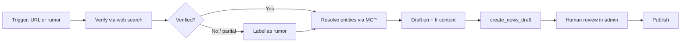

# Roster-change news agent playbook

**Linear:** [SAR-127](https://linear.app/sarpbc/issue/SAR-127/roster-change-news-agent-workflow-client-side-research-mcp-drafting)

Repeatable workflow for an MCP client (Claude Desktop, Cursor, etc.) to turn a roster-change announcement into **sourced, bilingual news drafts** on sarpbc.org. The agent does client-side web research; the SARPBC MCP server supplies entity data and `create_news_draft` / `update_news_article`. **Humans always review and publish** in the admin app.

## Prerequisites

| Requirement | Details                                                                                            |
| ----------- | -------------------------------------------------------------------------------------------------- |
| MCP client  | Claude Desktop, Cursor, or any client with **web search** and MCP tool use                         |
| SARPBC MCP  | `POST https://api.sarpbc.org/mcp` (local: `http://localhost:4001/mcp`)                             |
| Auth        | Personal access token from admin → **Tokens** (`/tokens`). Header: `Authorization: Bearer <token>` |
| Permission  | `news.manage` on your staff role (required for news list/get/create/update tools)                  |

Client configuration examples live in the root [README.md](../../README.md#mcp-server).

### MCP tools used in this playbook

**Read** (any valid PAT):

| Tool                   | Parameters                                            | Returns (summary)                                                    |
| ---------------------- | ----------------------------------------------------- | -------------------------------------------------------------------- |
| `search_players`       | `query` (string, min 1)                               | Up to 20 players: `id`, `slug`, `name`, `nationality`, `team`, `url` |
| `search_teams`         | `query` (string, min 1)                               | Up to 20 teams: `id`, `slug`, `name`, `url`                          |
| `get_player`           | `idOrSlug` (slug or UUID)                             | Player profile + current team + `url`                                |
| `get_team`             | `idOrSlug` (slug or UUID)                             | Team profile, roster, `location`, `url`                              |
| `get_tournaments`      | `activeOnly?` (boolean), `limit?` (1–100, default 20) | Tournament list with `url`                                           |
| `get_tournament`       | `id` (UUID)                                           | Full tournament detail, matches, participants                        |
| `get_upcoming_matches` | `limit?` (1–100, default 20)                          | Upcoming + live matches                                              |
| `get_match_results`    | `limit?` (1–100, default 20)                          | Recent finished results                                              |

**News** (requires `news.manage`):

| Tool                  | Parameters                                                                                     | Notes                                                                                                                                                                                                                                                                                                                                                                                                          |
| --------------------- | ---------------------------------------------------------------------------------------------- | -------------------------------------------------------------------------------------------------------------------------------------------------------------------------------------------------------------------------------------------------------------------------------------------------------------------------------------------------------------------------------------------------------------- |
| `list_news_articles`  | `page?` (0-based, default 0), `limit?` (1–100, default 20)                                     | Includes drafts. Titles/slugs only — call `get_news_article` for full body.                                                                                                                                                                                                                                                                                                                                    |
| `get_news_article`    | `idOrSlug` (slug or UUID)                                                                      | Full EN/FR fields, `isDraft`, `adminEditUrl`. Use before editing.                                                                                                                                                                                                                                                                                                                                              |
| `create_news_draft`   | `title` (required), `content` (required), `titleFr?`, `contentFr?`, `imageUrl?` (URL), `slug?` | Write **English** title and body. Optionally add **French** `titleFr` / `contentFr` on the same article. When mentioning a player or team, you MUST use `:player{slug="…" label="…"}` and `:team{slug="…" label="…"}` (resolve slugs with `search_players` / `search_teams`). Creates a **draft** (`isDraft: true`). Returns `adminEditUrl` for review. Slug is generated from the English title when omitted. |
| `update_news_article` | `idOrSlug` (required), `title?`, `content?`, `titleFr?`, `contentFr?`, `imageUrl?`, `slug?`    | Patch only the fields to change. Pass `null` for `titleFr`, `contentFr`, or `imageUrl` to clear them. Does **not** publish. Same player/team MDC tags as create.                                                                                                                                                                                                                                               |

News articles share **one slug**. English `title` + `content` are required. French `titleFr` + `contentFr` are optional on the same draft; `/fr` readers see French when both French fields are filled, otherwise English.

---

## Workflow overview



---

## 1. Trigger

Start when you have any of:

- **Official announcement URL** — team site, player social post, org press release, tournament organizer statement.
- **Credible rumor** — trusted journalist, multiple independent reports, or screenshot chain without an official post yet.
- **Staff tip** — editor forwards a link or screenshot with “possible roster move.”

Capture before proceeding:

- Announcement URL (or “no primary URL yet” for rumors)
- Player name(s) and team name(s) mentioned
- Move type: signing, departure, bench, loan, retirement, role change
- Approximate date of the announcement

---

## 2. Verification (client-side web search)

Use the MCP client’s **own web search** — not SARPBC tools. The API has no social scrapers or RSS ingestion.

### What counts as verified

Treat the move as **verified** when you find a **primary source**:

| Tier                       | Examples                                                                                  | Label in article                                    |
| -------------------------- | ----------------------------------------------------------------------------------------- | --------------------------------------------------- |
| **Primary**                | Official team/player/org account post; team website news page; verified org press release | State as fact; cite the primary link                |
| **Secondary confirmation** | Tournament organizer, league, or publisher reposting the same move with attribution       | Fact, cite primary; secondary optional              |
| **Single credible report** | One established esports journalist with track record, no official post yet                | **Rumor** until primary appears                     |
| **Unverified**             | Random account, Discord leak, single screenshot, “sources say” with no outlet             | Do **not** draft as fact; escalate to staff or wait |

### Verification checklist

1. Search for `[player name] [team name] Rocket League` and the announcement URL if provided.
2. Confirm the **account or domain** matches the real org (check linked site, verification badge, cross-posts).
3. Note **date and time** (UTC) of the primary post.
4. If the player **leaves** a team, check whether the old team has confirmed (or silence is noted).
5. Save the **canonical URL** you will cite in the article (prefer the original post over aggregators).

### Rumor labeling rules

When no primary source exists:

- Headline must include **Rumor:** (en) or **Rumeur :** (fr) as the first word.
- Lead sentence must name the **reporting outlet or reporter**, not present the move as done.
- Use conditional language: “would join”, “serait en passe de rejoindre”.
- Do **not** call `create_news_draft` until a staff editor explicitly asks to publish rumor coverage, or your org policy allows rumor drafts.

When a primary source appears later, **update or replace** the draft before publish — do not leave rumor language on a confirmed move.

---

## 3. Entity resolution (MCP read tools)

Resolve every player and team to SARPBC slugs before drafting. Use returned `url` fields for internal links in copy and entity tags.

### Resolution order

1. **`search_players`** with `query: "<player name>"`
   - Pick the match whose `name` and `team` fit the story.
   - If multiple homonyms, use tournament context or `get_player` on candidates.

2. **`search_teams`** with `query: "<team name>"`
   - Prefer exact name matches; watch for rebrands (old vs new name).

3. **`get_player`** with `idOrSlug: "<slug>"`
   - Confirm `team` reflects **current DB state** (may lag the announcement — note in draft if outdated).

4. **`get_team`** with `idOrSlug: "<slug>"`
   - Pull roster for context (“joins a roster that already includes …”).

5. **Tournament context** (optional):
   - `get_tournaments` with `activeOnly: true` if the move ties to an ongoing event.
   - `get_tournament` with `id` when you need bracket or participant detail.

### Handling mismatches

| Situation                   | Action                                                                                           |
| --------------------------- | ------------------------------------------------------------------------------------------------ |
| Player not in index         | Draft with plain name; omit `:player{…}` tag. Note in review checklist: “create player profile.” |
| Wrong team on player record | Draft using announcement facts; flag for staff to update player/team in admin after publish.     |
| Team not in index           | Plain team name in prose; flag for staff to create team.                                         |
| Ambiguous search results    | Do not guess. List candidates in a staff note; ask editor to pick slug.                          |

### Entity tags in article body

After resolving slugs, embed MDC entity tags so the public site renders profile links:

```markdown
:player{slug="zen-rl" label="Zen"}
:team{slug="karmine-corp" label="Karmine Corp"}
```

Syntax: `:player{slug="<slug>" label="<display name>"}` or `:team{slug="<slug>" label="<display name>"}`. Labels may include spaces; escape double quotes in labels as `\"`.

---

## 4. Drafting

### SARPBC news style (roster changes)

| Element           | Guidance                                                                                                                                |
| ----------------- | --------------------------------------------------------------------------------------------------------------------------------------- |
| **Headline (en)** | Factual, present tense: `[Player] joins [Team]` / `[Player] leaves [Team]` / `[Team] signs [Player]`. Max ~90 characters when possible. |
| **Headline (fr)** | Natural French esports phrasing: `[Joueur] rejoint [Équipe]` — not literal calques.                                                     |
| **Lead**          | Who, what, which team, effective timing if stated — in the first 1–2 sentences.                                                         |
| **Body**          | Background (prior team, recent results), tournament impact, what the org said. Short paragraphs.                                        |
| **Quotes**        | Use blockquotes only for **verbatim** text from the primary source. Attribute immediately above or below.                               |
| **Sources**       | Final paragraph or inline link: “[Team] announced the move on [date](canonical URL).”                                                   |
| **Tone**          | Neutral, fan-informed, no hype (“legendary”, “shocking”) unless quoting.                                                                |
| **Markdown**      | Headers `##` for sections if needed; `**bold**` for emphasis sparingly; entity tags for resolved slugs.                                 |

### Bilingual delivery

Call `create_news_draft` **once** with English `title` / `content` and French `titleFr` / `contentFr`. Same slug. Do not create a second article. Adapt French naturally — not a machine-literal translation. Public `/news/<slug>` and `/fr/news/<slug>` share that slug; `/fr` uses French when both French fields are set.

### Copy-paste prompt template

Give this to the MCP client after verification and entity resolution. Replace `{{…}}` placeholders.

```text
You are a sarpbc.org staff writer covering Rocket League esports. Create bilingual news drafts for a roster change.

## Facts (verified)
- Move type: {{signing | departure | bench | other}}
- Player: {{display name}} (SARPBC slug: {{player-slug or "none"}})
- Team: {{display name}} (SARPBC slug: {{team-slug or "none"}})
- Prior team (if known): {{name}} (slug: {{slug or "none"}})
- Primary source URL: {{url}}
- Source tier: {{primary | secondary}}
- Announcement date (UTC): {{ISO date}}
- Tournament context (optional): {{tournament name or "none"}}

## MCP entity data
Paste JSON from get_player / get_team here for accuracy.

## Tasks
1. Write the ENGLISH article (markdown):
   - Headline: factual, present tense, no "Rumor:" unless facts are unverified.
   - Lead with who joined/left whom.
   - One paragraph of context (prior team, roster fit, active tournament if relevant).
   - Blockquote only if the primary source includes a verbatim quote.
   - Use :player{slug="…" label="…"} and :team{slug="…" label="…"} for resolved slugs.
   - End with a source line linking to the primary URL.
   - Do not invent stats or quotes.

2. Write the FRENCH article (markdown):
   - Adapt naturally for fr-FR readers; do not word-for-word translate idioms.
   - Same structure and facts as English.
   - Same entity tags (slugs are locale-neutral).
   - Source line in French.

3. Call create_news_draft once via SARPBC MCP:
   - title / content = English headline and body
   - titleFr / contentFr = French headline and body
   - slug = {{en-slug}} (shared; /fr uses the same URL)
   - imageUrl only if you have a rights-safe cover image URL (team logo CDN, official press kit). Omit otherwise.

4. Return the adminEditUrl and a 3-bullet summary for the editor.
```

### Example `create_news_draft` call

```json
{
  "title": "Zen joins Karmine Corp",
  "slug": "zen-joins-karmine-corp",
  "titleFr": "Zen rejoint Karmine Corp",
  "content": "French Rocket League star :player{slug=\"zen-rl\" label=\"Zen\"} has joined :team{slug=\"karmine-corp\" label=\"Karmine Corp\"}, the organization announced Tuesday.\n\nZen previously played for …\n\n> We are thrilled to welcome Zen to KC.\n>\n> — Karmine Corp\n\nKarmine Corp [announced the signing](https://example.com/post) on March 6, 2026.",
  "contentFr": "Le joueur français :player{slug=\"zen-rl\" label=\"Zen\"} a rejoint :team{slug=\"karmine-corp\" label=\"Karmine Corp\"}, selon l'annonce publiée par l'organisation mardi.\n\n…\n\nKarmine Corp a [confirmé le transfert](https://example.com/post) le 6 mars 2026."
}
```

The tool response includes `adminEditUrl` — open that link for human review.

### Revising a draft

If the editor asks for changes before publish, call `get_news_article` with the slug, then `update_news_article` with only the fields that changed. Do not create a second article. Do not publish via MCP.

```json
{
  "idOrSlug": "zen-joins-karmine-corp",
  "content": "…revised English body…",
  "contentFr": "…corps français révisé…"
}
```

---

## 5. Human review checklist (before publish)

Editor completes this in the admin app (`adminEditUrl`). **Do not auto-publish.**

### Accuracy & sourcing

- [ ] Primary source URL opens and matches the story
- [ ] Move type (join/leave) matches the announcement
- [ ] Player and team names spelled correctly
- [ ] Rumor labeling removed if a primary source now exists (or rumor label still appropriate)
- [ ] Quotes are verbatim from the source — no fabricated statements
- [ ] Dates and tournament names correct

### SARPBC data

- [ ] `:player` / `:team` tags use correct slugs (preview in admin)
- [ ] Player/team admin records updated if MCP data was stale (manual step in admin — out of MCP scope for SAR-127)
- [ ] No broken internal links

### Bilingual

- [ ] English and French title/body are both filled on the same article
- [ ] French reads naturally — not obvious machine translation

### Presentation

- [ ] Headline length reasonable; slug is clean (`a-z`, `0-9`, hyphens)
- [ ] Cover image (`imageUrl`) is official/rights-safe, or omitted
- [ ] Excerpt reads well (auto-derived from content on the site)

### Publish

- [ ] Publish when the story is ready (one article serves both locales)
- [ ] Spot-check public URLs: `https://sarpbc.org/news/<slug>` and `/fr/news/<slug>`

---

## 6. Validation plan

Run this playbook on **2–3 real roster changes** during an active tournament cycle (e.g. RLCS regional / major window). Record metrics per story:

| Metric              | How to measure                                                                          |
| ------------------- | --------------------------------------------------------------------------------------- |
| **Time to draft**   | Minutes from editor pasting trigger URL to both `adminEditUrl` links returned           |
| **Time to publish** | Minutes from announcement timestamp (primary post) to `isDraft: false` on both articles |
| **Edit burden**     | Count of substantive edits in admin (facts, tags, tone) vs typo fixes                   |
| **Entity hit rate** | % of players/teams resolved via `search_*` without manual slug lookup                   |
| **Source quality**  | Primary vs rumor tier on first draft                                                    |

### Suggested test cases

1. **Clean primary** — official team X post announcing a signing during a live tournament.
2. **Player departure** — org confirms release; prior team already known in DB.
3. **Messy case** — rebrand, nickname, or player missing from search (exercises fallback notes).

### Success criteria (initial)

- Draft-to-review under **15 minutes** for verified primary-source moves once the workflow is familiar.
- Publish within **60 minutes** of announcement for breaking moves during staffed tournament coverage (editor-dependent).
- Zero published articles without a cited primary URL (rumor pieces excepted and clearly labeled).

### Retrospective

After three trials, note:

- Whether admin player/team updates should become a follow-up ticket (explicitly out of scope for SAR-127 unless editing becomes the bottleneck).
- Prompt template tweaks (headline patterns, French phrasing).
- Any missing MCP read fields that would have saved editor time.

---

## Out of scope (SAR-127)

- Twitter/X API, RSS, scrapers, scheduled monitoring
- Auto-publish or MCP publish tool
- Updating roster/contract **data** via MCP (admin UI remains source of truth for DB updates)

## References

- [README — MCP server](../../README.md#mcp-server)
- MCP implementation: `apps/back/src/mcp/tools/read-tools.ts`, `apps/back/src/mcp/tools/write-tools.ts`
- Entity tag syntax: `packages/utils/src/news-entity-tag.ts`
- Admin news editor: `apps/admin/app/pages/news/`
